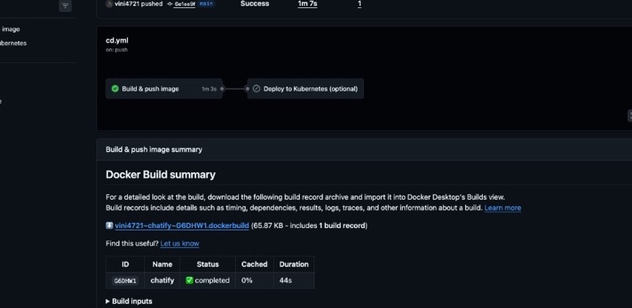

# Chatify

A full-stack real-time chat app with a Node.js/Express backend, Socket.IO, and a React/Vite frontend.

[](https://github.com/vini4721/chatify/actions/workflows/ci.yml)
[](https://github.com/vini4721/chatify/actions/workflows/cd.yml)
[](./Dockerfile)
[](./k8s/)
[](./terraform/)

## DevOps & CI/CD

This project is containerized and automated end-to-end:

| Layer | Tooling |
|-------|---------|
| **Container** | Multi-stage `Dockerfile`, Docker Compose (dev + prod) |
| **Orchestration** | Kubernetes manifests (`k8s/`, Kustomize) |
| **Infrastructure as code** | Terraform (`terraform/`) |
| **CI** | GitHub Actions — lint, build, smoke tests, manifest validation |
| **CD** | GitHub Actions — build & push image to [GHCR](https://github.com/vini4721/chatify/pkgs/container/chatify) |

On every push to `main`, the CD pipeline builds the Docker image and publishes it to GitHub Container Registry. Kubernetes deploy is optional (`workflow_dispatch`).

<p align="center">
  <a href="https://github.com/vini4721/chatify/actions/workflows/cd.yml">
    
  </a>
  <br />
  <em>CD workflow: automated Docker build & push (Kubernetes deploy optional)</em>
</p>

```bash
make dev          # Docker Compose — local dev stack
make build        # Production image
make k8s-apply    # Deploy to Kubernetes (local overlay)
make ci           # Run CI checks locally
```

More detail: **[docs/DEVOPS.md](docs/DEVOPS.md)**

## Features

- JWT signup/login/logout flow
- Real-time private messaging
- Online/offline presence
- Typing indicators
- Unread message badges
- Profile picture updates
- Image messages
- Welcome email support
- Cloudinary image uploads
- Production static serving from the backend

## Project Structure

- `Backend/` - Express API, MongoDB, Socket.IO, email and upload integrations
- `Frontend/` - React UI, routing, stores, chat views

## Requirements

- Node.js 18+
- MongoDB
- Optional: Cloudinary, Resend

## Setup

### 1. Backend environment

Create `Backend/.env` from `Backend/.env.example` and fill in the values.

Minimum required values:

```bash
PORT=3000
MONGO_URI=mongodb://127.0.0.1:27017/chat_app
JWT_SECRET=your_secure_secret
CLIENT_URL=http://localhost:5173
NODE_ENV=development
```

Optional integrations:

```bash
RESEND_API_KEY=your_resend_api_key
EMAIL_FROM=your_verified_email@example.com
EMAIL_FROM_NAME=Chatify

CLOUDINARY_CLOUD_NAME=your_cloud_name
CLOUDINARY_API_KEY=your_api_key
CLOUDINARY_API_SECRET=your_api_secret
```

### 2. Install dependencies

```bash
cd Backend
npm install

cd ../Frontend
npm install
```

### 3. Run in development

Start the backend:

```bash
cd Backend
npm run dev
```

Start the frontend:

```bash
cd Frontend
npm run dev
```

Frontend runs on `http://localhost:5173` and backend on `http://localhost:3000`.

## Production

Build the frontend:

```bash
cd Frontend
npm run build
```

Then start the backend with production env values:

```bash
cd Backend
npm start
```

In production, the backend serves the built frontend from `Frontend/dist`.

## DevOps reference

### Docker & Compose

```bash
make dev          # MongoDB + API + Vite (ports 5173 / 3000)
make prod         # Single production image + MongoDB (port 3000)
make build        # docker build -t chatify:latest .
```

### Kubernetes

```bash
make build && make k8s-apply    # minikube / kind / Docker Desktop K8s
```

Manifests: `k8s/base` + `k8s/overlays/local` (NodePort `30080`).

### Terraform

```bash
cp terraform/terraform.tfvars.example terraform/terraform.tfvars
make tf-init && make tf-apply
```

### Workflows

| Workflow | Trigger | Purpose |
|----------|---------|---------|
| [`ci.yml`](.github/workflows/ci.yml) | PR / push | Lint, build, smoke test, Docker build, Kustomize + kubeconform, `terraform validate` |
| [`cd.yml`](.github/workflows/cd.yml) | push `main` | Push image to **GHCR**; optional K8s deploy via `workflow_dispatch` |

Health endpoint: `GET /api/health` (Docker & Kubernetes probes).

## Notes

- If Cloudinary keys are not configured, image upload features will not persist to Cloudinary.
- If Resend is not configured, signup still works and email sending is skipped safely.
- The app uses token-based auth stored locally in the browser for development convenience.

## Scripts

### Backend

- `npm run dev` - start the API with nodemon
- `npm start` - start the API with node

### Frontend

- `npm run dev` - start Vite dev server
- `npm run build` - build production assets
- `npm run lint` - run ESLint

## License

For personal and educational use unless you add a license.
